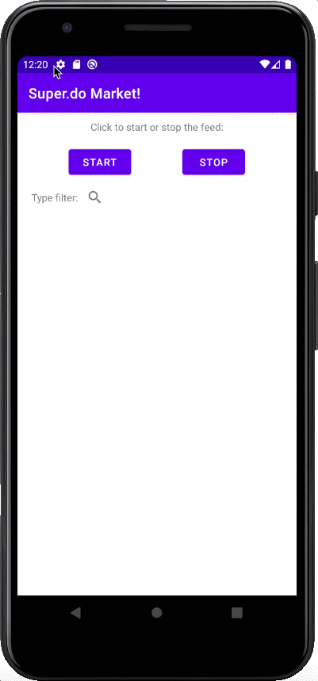

# WebSocket (Motiv8AI)

Modern android app based <b>MVVM</b> architecture using WebSocket where you are able to start or stop displaying dynamic feed of groceries as well as filtering among them

used libraries/features:
* <b>Corutines</b> - Asynchronous programming
* <b>Hilt</b> - Dependency Injection
* <b>OkHttp</b> - HTTP & HTTP/2 client 
* <b>Room</b> - DB

